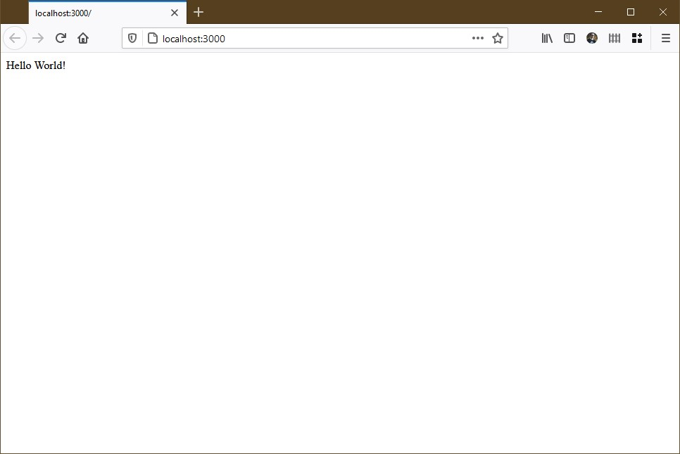

# Hello World

Im letzten Teil haben wir uns mit der Installation von Node und Express auseinandergesetzt. Nun werden wir versuchen das im letzten Teil angelegten skript genauer anschauen.

---
```javascript
const express = require('express')
```javascript

1. Nachdem Node.js installiert wurde, legt man sich einen Projektordner an
   
        mkdir new_Project
        cd new_Project

2. Danach muss man ein neues Node.js Projekt initiieren
    
        npm init 
   
3. Nun müsste man express.js mit dem Node Package Manager(NPM) installieren
   
        npm install express

4. Nun folgt noch ein kleines Codebeispiel, in diesem soeben angelegten Verzeichnis erstellen wir eine Datei names app.js 
   
         touch app.js

5. Nun können wir in diese Date folgenden Code einfügen.

         const express = require('express')
         const app = express()
         const port = 3000
         
         app.get('/', (req, res) => {
         res.send('Hello World!')
         })
         
         app.listen(port, () => {
         console.log(`Example app listening at http://localhost:${port}`)
         })

6. Zum Starten führen wir den Befehl aus

         node app.js  

Jetzt sollten wir unsere erste kleine Website haben.



## Quellen

* [Installation Node.js](https://nodejs.org/de/)
* [Installation Express.js](https://expressjs.com/de/starter/installing.html)

 