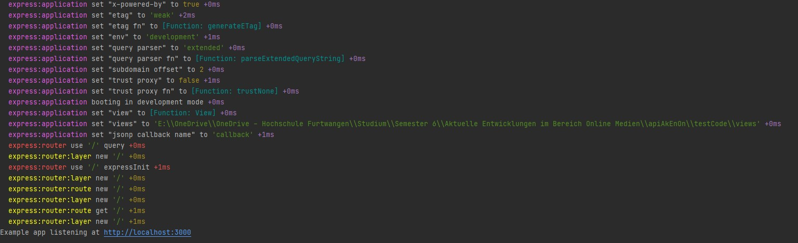
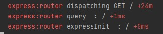

# Debugging Experess

Um unsere Applikation debuggen zu können müssen wir nur einen Parameter vor dem Ausführen unseres Node Server anpassen.
Und zwar den *DEBUG* Parameter.

```bash
set DEBUG=express:* & node application.js
```

Als Basis für dieses Experiment nehmen wir wieder unser Hallo Welt Skript und Modifizieren es gegebenenfalls.

```javascript
const express = require('express')
const app = express()
const path = require('path');
const port = 3000

app.get("/", (req, res) => {
    res.send('Hello Home!')
})


app.listen(port, () => {
    console.log(`Example app listening at http://localhost:${port}`)
})
```

Sobald wir unseren Server Starten bekommen wir nun folgende Ausgabe.


Express verwendet zum Debuggen einer Applikation das npm Modul [debug](https://www.npmjs.com/package/debug). Alles was
dieses neue Packet macht, ist, eine Logging function in unser Projekt zu integrieren. In diese Debug Funktion gibt man
dann einfach den Namen seines Moduls ein und eine Log-Message. Das Debug Modul kümmert sicht dann um die Farbliche
Darstellung der Log-Message. Würden wir Express nicht verwenden sähe der Aufruf dieser Funktion so aus:

```javascript
debug(method + ' ' + message);
```

Express bringt dies alles jedoch schon mit, d.h wir müssen uns hier nicht darum kümmern das Logging selbst zu
integrieren. Eine wesentliche Stärke von diesen Debugging ist es, die eingehenden requests zu inspizieren. Sollte ein GET
request auf "*/*" eingehen, sieht das wie folgt aus.


